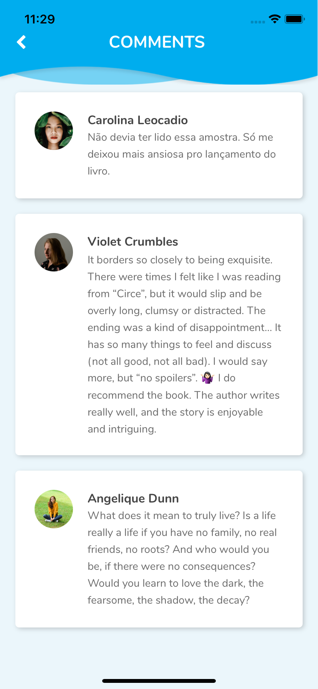
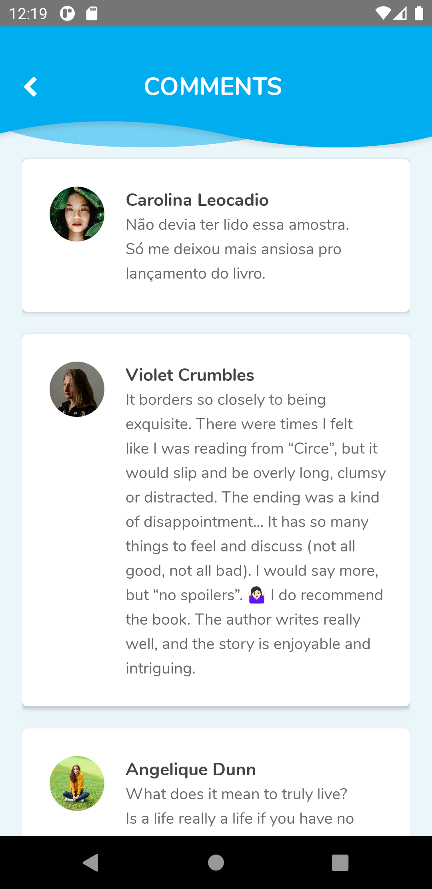

# Library's Owl

Library's owl is an app that allows you to rent books from a virtual library with just a few taps, it saves your rents and suggest you new books based on the books that you're interested.

Built using React Native, so it's available to use on both Android and iOS.

Library's Owl app fetches the lyrics data from the following [API](https://owls-library.herokuapp.com/).

## Preview

### iOS

### Android

## Before you begin

Please make sure you are using the required [tools](https://github.com/JosePBrotons/mobile-dev-tools) before checking this app.

## Installation

To start checking this project please proceed with the scripts bellow:

$ git clone git@github.com:JosePBrotons/lyrics-hunter.git

$ yarn install

---

## Run the app

To start running the app in debug mode first make sure you start the metro bundler by running this script:

$ yarn start

Then execute the following script:

Android:

$ yarn android

iOS:

$ yarn ios

Thanks

---

**Jose Brotons** © 2020

> GitHub [@josepbrotons](https://github.com/JosePBrotons)
